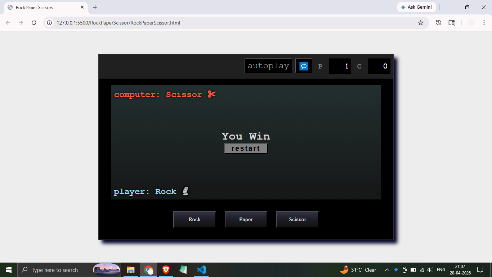

# Title: Rock Paper Scissors

This is a simple rock papers scissors game made using html, css and javascript

## Directory Structure:  
├── index.html   # Main HTML structure  
├── style.css    # Styling for the game UI  
├── script.js    # Game logic and interactions  

## How to run:
    Open index.html on any browser

## Interface Breakdown
-Top Board
    Autoplay button
    Reset button
    Player (P) score
    Computer (C) score
-Game Status Section
    Displays current messages (e.g., "Choose your move", results)
    Shows player and computer labels
    Restart button (visible when needed)
    Moves Section
-Buttons for:
    Rock
    Paper
    Scissor

## Important: Ensure style.css and script.js are in the same directory as index.html

## Screenshot:

